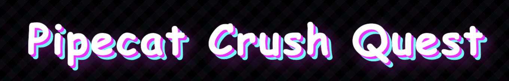

<h1><div align="center">
 
</div></h1>

A webrtc/voice AI game to discover who likes you <3

Built using [Pipecat](https://github.com/pipecat-ai/pipecat), [Pipecat Cloud](https://pipecat.daily.co/), Gemini Live, and Daily.

## Demo

TL;DR: Talk to bots and ask for clues about who has a crush on you.

Start the quest [here](https://daily-co.github.io/pipecat-crush-quest/)

## Table of Contents

- [Directory Structure](#directory-structure)
- [Local Development](#local-development)
- [Configure Production](#configure-production)
- [Deploy to Production](#deploy-to-production)
- [Troubleshooting](#troubleshooting)

----------
## Directory Structure
- `/docs`: files to publish game board website via [GitHub Pages](https://docs.github.com/en/pages/getting-started-with-github-pages/configuring-a-publishing-source-for-your-github-pages-site#about-publishing-sources).
- `/game-board`: code used to generate character images (Nano Banana) and QR Code.
- `/pc_bot`: the Pipecat bot code. deploy to pipecatcloud from here.

----------
## Local Development

### Dependencies

- Python 3.10+
- `uv` package manager
- Gemini API Key
  * [required] permissions to use Gemini Live model `gemini-2.5-flash-native-audio-preview-09-2025`
  * [optional] permissions to use Nano Banana (to generate new character images)
- Daily API Key
  * [required] for prod
  * [optional] for local dev

### Setup

0. Clone repo:

```sh
git clone https://github.com/daily-co/pipecat-crush-quest.git
cd crush-quest
```

1. Set up a virtual environment and install dependencies:

```sh
cd pc_bot
uv sync
```

2. Create an .env file and add API keys:

```sh
cp env.example .env
```

----------
## Configure Production

* under construction *

## Troubleshooting
- 📚 Learn more with[Pipecat's docs](https://docs.pipecat.ai/)
- 💬 Get help: Join [Pipecat's Discord](https://discord.gg/pipecat) to connect with the community
