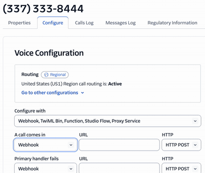

<h1><div align="center">
 
</div></h1>

A telephonic game to discover who likes you <3

Built using [Pipecat](https://github.com/pipecat-ai/pipecat), [Pipecat Cloud](https://pipecat.daily.co/), Gemini Live, and Twilio.

## Demo

TL;DR: Call bots on the telephone and ask for clues about who has a crush on you.

Start the quest [here](https://daily-co.github.io/pipecat-crush-quest/)

## Table of Contents

- [High level 'How It Works'](#high-level-how-it-works)
- [Directory Structure](#directory-structure)
- [Local Development](#local-development) ( sans telephony/Twilio )
- [Configure Production](#configure-production)
- [Deploy to Production](#deploy-to-production)
- [Troubleshooting](#troubleshooting)

----------
## High level 'How It Works'

1. Purchase a phone number on Twilio and configure it to call a `TwiML bin` when it receives a call. 
2. Make a Pipecat bot using `FastAPIWebsocketTransport` for transport layer.
3. Deploy bot to Pipecat Cloud (ensure there is a `async def bot(runner_args: RunnerArguments)` function).
4. When someone calls that phone number, the `TwiML` tells Twilio to start a WebSocket stream to your bot.
5. Audio streams between caller and your bot over the WebSocket connection.
6. Profit. (or in Crush Quest's case, Enjoy.)

----------
## Directory Structure
- `/docs`: files to publish game board website via [GitHub Pages](https://docs.github.com/en/pages/getting-started-with-github-pages/configuring-a-publishing-source-for-your-github-pages-site#about-publishing-sources).
- `/game-board`: code used to generate character images (Nano Banana) and QR Code.
- `/pc_bot`: the Pipecat bot code. deploy to pipecatcloud from here.

----------
## Local Development

This is a bare-bones development environment with minimal dependencies (basically just Python 3.10+ and a Gemini API Key).
It's not really "playable" in terms of the game, but it is super useful for experimenting with Pipecat code and prompts, etc.

### Dependencies

- Python 3.10+
- `uv` package manager
- Gemini API Key
  * [required] permissions to use Gemini Live model `gemini-2.5-flash-native-audio-preview-09-2025`
  * [optional] permissions to use Nano Banana (to generate new character images)

### Setup

0. Clone repo:

```sh
git clone https://github.com/daily-co/pipecat-crush-quest.git
cd crush-quest
```

1. Set up a virtual environment and install dependencies:

```sh
cd pc_bot
uv sync
```

2. Create an .env file and add API keys:

```sh
cp env.example .env
```

### Call a bot character aka "Crush Potential"

from `/pc_bot` directory:

```sh
python bot.py --port <last four digits of phone number>
```

for example, Taylor's phone number is `+1-337-333-8444`. To talk to Taylor:

1. run command `python bot.py --port 8444`
```sh
$ python bot.py --port 8444
==>
2025-10-08 10:44:44.726 | INFO     | pipecat:<module>:14 - ᓚᘏᗢ Pipecat 0.0.86 (Python 3.12.0 (main, Oct  2 2023, 20:56:14) [Clang 16.0.3 ]) ᓚᘏᗢ

🚀 Bot ready!
   → Open http://localhost:8444/client in your browser

Looking for dist directory at: /PATH/crush-quest/pc_bot/.venv/lib/python3.12/site-packages/pipecat_ai_small_webrtc_prebuilt/client/dist
INFO:     Started server process [14570]
INFO:     Waiting for application startup.
INFO:     Application startup complete.
INFO:     Uvicorn running on http://localhost:8444 (Press CTRL+C to quit)
```
2. Navigate to [`http://localhost:8444`](http://localhost:8444) and click `connect` in the upper right corner.
3. Talk to Taylor and ask who has a crush on you.

4. After the call, `Ctrl-C` the server. To test a different character, say Chris, run:
```sh
python bot.py --port 8102
```
because Chris' phone number is `+1-337-333-8102`.

----------
## Configure Production

## Prerequisites

- Docker Desktop ([linux](https://docs.docker.com/desktop/setup/install/linux/), [mac](https://docs.docker.com/desktop/setup/install/mac-install/), [windows](https://docs.docker.com/desktop/setup/install/windows-install/))
- A [Docker account](https://app.docker.com/signup)
- A [Pipecat Cloud account](https://pipecat.daily.co/sign-up)
- A [Twilio account](https://www.twilio.com/login)
- [Local Development Prerequisites](#prerequisites)

- choose an `Agent Name`. This will be used in Docker, Pipecat Cloud, and Twilio steps.
-- the Agent Name in this repo is `crush-quest`. maybe use that.

### Docker
Push to DockerHub so Pipecat Cloud can pull image.

1. login to Docker
2. Build / Tag / Push
- [Dockerfile](pc_bot/Dockerfile) has all the Pipecat Cloud goodies in it already.
```sh
export AGENT_NAME="crush-quest"
export DOCKER_USERNAME="yup"

docker build --platform=linux/arm64 -t $AGENT_NAME:latest .
docker tag $AGENT_NAME:latest $DOCKER_USERNAME/$AGENT_NAME:latest
docker push $DOCKER_USERNAME/$AGENT_NAME:latest
```
> [!NOTE]
> Be aware, Docker repos are `PUBLIC` by default. Don't put `.env` in there.

### Pipecat Cloud
Create agent on Pipecat Cloud platform.

1. click `+ Deploy new agent` button in the upper right corner.
  * `Name`: the `Agent Name` you chose. most likely `crush-quest`
  * `Image`: `$DOCKER_USERNAME/$AGENT_NAME:latest` ie, `my_docker_username/crush-quest:latest`
  

  * `Image Pull Secret`: used to pull the docker image. required by Pipecat Cloud.
  * click the `Select...` dropdown menu, then click `+ create`
    

> [!IMPORTANT]
> `Auth Value` your `$DOCKER_USERNAME` and your Docker password formatted like so:
`docker_username:docker_password`
More info on Image Pull Secrets [here](https://docs.pipecat.ai/deployment/pipecat-cloud/fundamentals/secrets#image-pull-secrets)

  * `Secret`: this is where `.env` values go! You didn't copy them in your Dockerfile (way to go!), this is the safe place to add them.
  * click the `Select...` dropdown menu, then click `+ create`
  
  * click `Import .env file` and copy pasta your .env variables
  

2. click `Create agent`

> [!NOTE]
> `Create agent` deploys the agent, but it won't work without Twilio configured. Keep going...

3. Add a credit card
- Navigate to `Settings > Billing` or `https://pipecat.daily.co/ORGANIZATION_NAME/settings/billing`

> [!TIP]
> Keep an eye on billing at `https://pipecat.daily.co/ORGANIZATION_NAME/settings/invoices`

### Twilio
Create TwiML and configure telephony.

1. Add to your `.env`:
- [TWILIO_ACCOUNT_SID](https://console.twilio.com/us1/account/manage-account/general-settings)
- [TWILIO_AUTH_TOKEN](https://console.twilio.com/us1/account/keys-credentials/api-keys)

2. [Purchase a phone number](https://console.twilio.com/us1/develop/phone-numbers/manage/search) for each character aka "Crush Potential".
`Phone Numbers > Manage > Buy a number`

3. Create TwiML: Navigate to [TwiML bin dashboard](https://console.twilio.com/us1/develop/twiml-bins/twiml-bins?frameUrl=%2Fconsole%2Ftwiml-bins).

4. Add this TwiML and name it `pipecat-crush-quest`:

```xml
<?xml version="1.0" encoding="UTF-8"?>
<Response>
  <Connect>
    <Stream url="wss://api.pipecat.daily.co/ws/twilio">
      <Parameter name="pipecatCrushQuestTo" value="{{To}}"/>
      <Parameter name="pipecatCrushQuestFrom" value="{{From}}"/>
      <Parameter name="_pipecatCloudServiceHost" value="AGENT_NAME.ORGANIZATION_NAME"/>
    </Stream>
  </Connect>
</Response>
```


`AGENT_NAME` is the name of the Pipecat bot. 
- Find it under the `Agents` tab in Pipecat Cloud dashboard, but it is most likely `crush-quest`.

`ORGANIZATION_NAME` is your Pipecat Cloud organization name. 
- Find the name in the dashboard URL:
`https://pipecat.daily.co/ORGANIZATION_NAME`

[more info about TwiML bins](https://help.twilio.com/articles/360043489573-Getting-started-with-TwiML-Bins)

5. Configure phone numbers
Configure each phone number to direct incoming calls to this TwiML. Use this same TwiML for every phone number.

- Navigate to [(Phone Numbers > Manage > Active numbers)](https://console.twilio.com/us1/develop/phone-numbers/manage/incoming)
- Select a phone number and in "Configure" tab, under “Voice Configuration” section, find “A call comes in”
Set this dropdown to “TwiML Bin” and select the `pipecat-crush-quest`

> [!IMPORTANT]
> Click `Save` at bottom of page to apply your changes
- Repeat this for each phone number

> [!TIP]
> Keep an eye on billing [here](https://console.twilio.com/us1/billing/manage-billing/billing-overview).

----------
## Deploy to Production
Once the three pillars are configured (Docker, Pipecat Cloud, and Twilio), the app is deployed!

To re-deploy, build/tag/push the Docker image and deploy to Pipecat Cloud.

### Docker
```sh
docker build --platform=linux/arm64 -t $AGENT_NAME:latest .
docker tag $AGENT_NAME:latest $DOCKER_USERNAME/$AGENT_NAME:latest
docker push $DOCKER_USERNAME/$AGENT_NAME:latest
```

### Deploy to Pipecat Cloud via CLI
1. Update [`pcc-deploy.toml`](pcc_bot/pcc-deploy.toml) with your docker username (and agent name if not `crush-quest`)
2. Use `pcc` command line:
```sh
pcc auth login
pcc deploy
```

### Deploy to  Pipecat Clou via dashboard
1. Navigate to `Agents > crush-quest > Deployments`
2. Click `+ Add Deployment` in the upper right corner.
3. Navigate to `Overview` to monitor Deployment status

4. Green checkmarks mean you are good to call one of your Crush Potentials on the phone!


## Troubleshooting
- 📚 Learn more with[Pipecat's docs](https://docs.pipecat.ai/)
- 💬 Get help: Join [Pipecat's Discord](https://discord.gg/pipecat) to connect with the community
